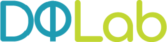

# PROA-Data-Science
Data Science Portofolio

  

  <a href="https://academy.dqlab.id/main/module">DQLab</a> adalah portal belajar data yang sangat lengkap. Jika kamu ingin menjadi seorang praktisi data, maka wajib untuk belajar di DQLab. Terdapat tiga bahasa pemrograman yang disediakan, yakni R, Python, dan SQL. Ketiga bahasa tersebut sangat populer di dunia Data Science sekarang ini.

  Terima kasih kepada KOMINFO memberikan saya kesempatan mendapatkan <b>Scholarship digitalent</b>. Di DQLab, terdapat menu <b>Learn</b> dimana kita bisa belajar materi yang disajikan dengan sangat lengkap dan runtut, sehingga tidak perlu bingung mau mulai dari mana. Kemudian terdapat juga beberapa <b>Project</b> yang dibuat berdasarkan kasus di lapangan, jadi kita bisa belajar dan merasakan langsung peran dari seorang praktisi data. Tidak lupa juga terdapat <b>Career Track</b> yang bisa menjadi awal bagi kita dalam memulai karir di bidang data.

  Repositori ini saya gunakan untuk menyimpan dan membagikan data sebagai hasil dari belajar dan mengerjakan project di DQLab. Dalam setiap folder akan saya lampirkan dokumen markdown dan data yang digunakan dalam materi atau project yang bersangkutan.

---

<!-- # Learn -->

<h1 align="center">SKILL TRACK</h1>

  </a>

<h1 align="center">PROJECT</h1>

   1. Data Science in Marketing - Customer Segmentation 
  2. Project Machine Learning for Retail with R - Product Packaging
   3. Project Analisa Klasifikasi Pinjaman Untuk Sektor UMKM (Exam) 
  4. Project Assessment Using R (Final Project)

